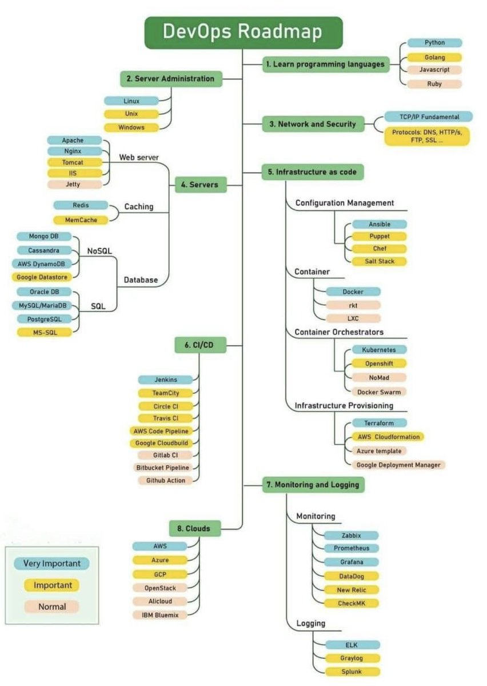

# Azure DevOps

Devops?&#x20;

&#x20;Combination of: Concepts -> Tools -> Practices\
\
Goals: Fast -> Automated -> High Quality

### Plan -> Work Process

* What needs to be developed (features, bugfixes)
* Why - Business value
* Which roles?
* How to divide and split tasks?&#x20;
* Agile and Scrum.

#### Azure Boards (Jira)

### Code ->&#x20;

#### Azure Repos (Git)

<mark style="color:red;">**What's the company git approach?**</mark>&#x20;

#### GitHub Flow / Trunk based

#### Gitflow (`master`, `develop`, `feature`, `release`, and `hotfix`.)

.png>)

#### 

