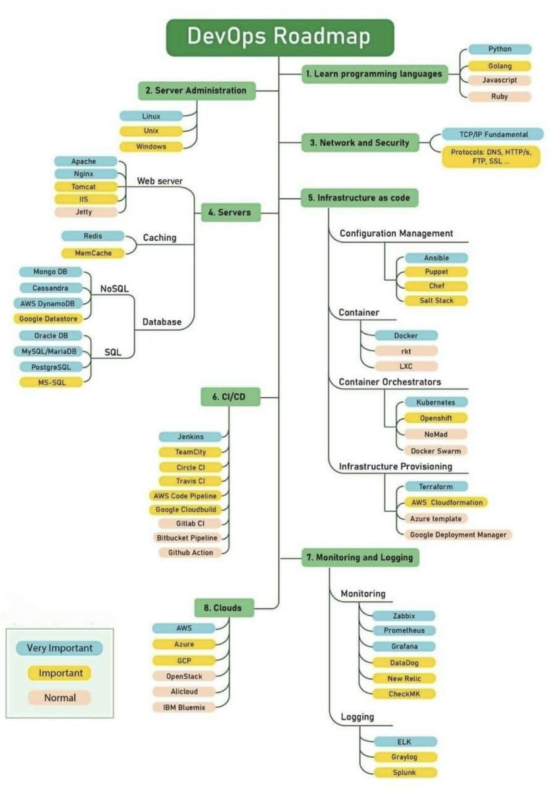

# 0 - Skills

## Roadmap

.png>)

.png>)

## Certification Path

1. Cloud Practitioner - Done
2. Solutions Architect Associate - Done
3. Terraform  - Done
4. Solutions Architect Professional - In progress
5. DevOps Engineer
6. SysOps Administrator Associate
7. Developer
8. Security
9. Advanced Networking

## Mid Engineer

Cloud

&#x20;   \- 3+ years experience working full time on one of the 3 major clouds.

&#x20;   \- Working with either Linux or windows OS, containers etc.

&#x20;   \- Working with databases either SQL or NOSQL.

&#x20;   \- Working all the way through the stack, network --> machine --> DB --> App --> User

&#x20;

Work&#x20;

&#x20;   \- Able to perform most tasks by themselves, asking for help or guidance as required.

&#x20;   \- Able to reference documentation and follow as required.

&#x20;   \- Able to come up to speed decently quickly on new environments or projects.

&#x20;   \- Able to identify and prioritise tasks based on current goals.

&#x20;

Scripting

&#x20;   \- Able to write scripts in a high level language, shell, python, javascript, etc.

&#x20;   \- Able to read and make changes to existing scripts confidently (250+ lines)

&#x20;

IaaC

&#x20;   \- Able to setup, write and change infrastructure as code with minimal guidance (Terraform, cloud formation, ARM templates)

&#x20;   \- Able to write custom modules (terraform) or equivalent.

&#x20;  \- Able to explain the advantages of IaaC, and outline workflows for code updates.

&#x20;

CI/CD

&#x20;   \- Able to describe all the key requirements for a CI Pipeline.

&#x20;   \- Able to setup a CI/CD pipeline for multiple simple applications.

&#x20;

Containers

&#x20;   \- Able to describe all the benefits of using containers.

&#x20;   \- Able to build and modify docker images, follow best practice.

&#x20;   \- Able to run containers using either docker or kubernetes.
