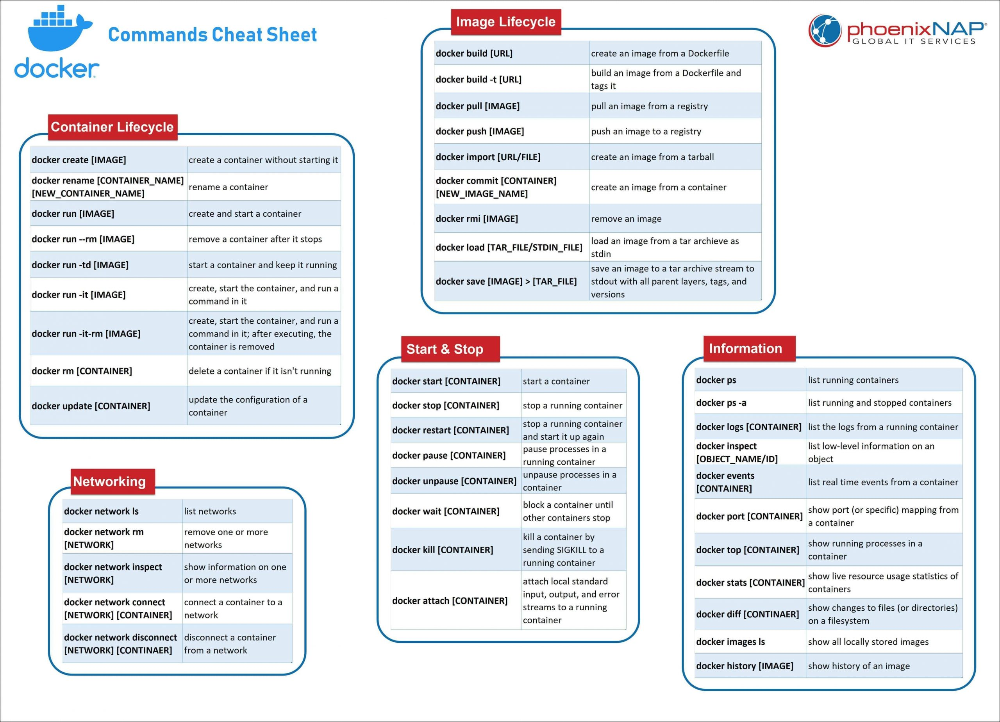

# Docker

DOCKER vs VM/OS\


Advantages:\
Docker runs on the application layer only. \
Smaller Size = MB vs GB \
Speed: Faster \
Compatibility: Can run on many different OS Host&#x20;


What problems do containers solve? \
\
First, Docker helps you package applications and their dependencies into portable application images that are straightforward to distribute to artifact repositories and then onto container hosts that will run them. In another words, your software stays system agnostic, making software simpler to use, and less work to develop.&#x20;

* Meaning apps run the same, no matter where they are of what machine they are running
* Missing or incorrect application dependencies
* Conflicts between programs running on the same computer such as library dependencies or ports
* Limiting the amount of resources such as cpu and memory an application can use
* Missing, complicated, or immature scripts to install, start, stop, and uninstall an application

Docker images also allow you to define metadata that helps operators _run_ the application, including:

* a default command Docker should run to start the application, e.g. /start.sh
* ports, environment variables, and the working directory the application expects to use
* directories (volumes) the application expects to files to be mounted into
* labels that describe what is inside the image using key-value pairs

### Running applications in isolation

Second, Docker’s container engine and command line tool make it simple to retrieve application images and start isolated instances of each application process.

Let’s step through how Docker turns an image into a container:


What is docker-composer?&#x20;

Is a tool that was developed to help define and share multi-container applications.


Why do we need a registry?&#x20;

A place for developers to store container images and share them out via a process of uploading (pushing) to the registry and downloading (pulling) into another system, like a [Kubernetes cluster](https://www.redhat.com/en/topics/containers/what-is-a-kubernetes-cluster)






**Image vs Container**


**Version and Tag**&#x20;

Version: 5.0.5&#x20;

****



## Docker Basic Commands <a href="#title" id="title"></a>

<table><thead><tr><th>Docker +</th><th>Description</th><th data-hidden>test</th></tr></thead><tbody><tr><td>pull</td><td>download image</td><td></td></tr><tr><td>run</td><td>creates the container and starts it</td><td></td></tr><tr><td>start</td><td>start any stopped containers</td><td></td></tr><tr><td>stop</td><td>stop container</td><td></td></tr><tr><td>ps</td><td>list running containers ONLY</td><td></td></tr><tr><td>logs + container id</td><td></td><td></td></tr><tr><td>exec -it DB /bin/bash</td><td>interact with container</td><td></td></tr><tr><td>env</td><td>environment </td><td></td></tr><tr><td>network ls</td><td></td><td></td></tr><tr><td>network create postgres</td><td></td><td></td></tr></tbody></table>

<table><thead><tr><th>RUN</th><th>Description</th><th data-hidden></th></tr></thead><tbody><tr><td>-d</td><td>detached mode</td><td></td></tr><tr><td>-p</td><td>docker port 6000 and host port 6795</td><td></td></tr><tr><td>-- name DB</td><td>container name = DB</td><td></td></tr><tr><td>postgres:10.10</td><td>image name and tag/version</td><td></td></tr><tr><td>net --name</td><td></td><td></td></tr></tbody></table>


```
docker run -d\ 
-p 27017:27017 \
-- name DB \ 
--net network \
postgres:10.10 
```



## docker ps <a href="#title" id="title"></a>

List containers

### Usage

```
$ docker ps [OPTIONS]
```

For example uses of this command, refer to the [examples section](https://docs.docker.com/engine/reference/commandline/ps/#examples) below.

### Options

| Name, shorthand   | Default | Description                                             |
| ----------------- | ------- | ------------------------------------------------------- |
| `--all` , `-a`    |         | Show all containers (default shows just running)        |
| `--filter` , `-f` |         | Filter output based on conditions provided              |
| `--format`        |         | Pretty-print containers using a Go template             |
| `--last` , `-n`   | `-1`    | Show n last created containers (includes all states)    |
| `--latest` , `-l` |         | Show the latest created container (includes all states) |
| `--no-trunc`      |         | Don't truncate output                                   |
| `--quiet` , `-q`  |         | Only display container IDs                              |
| `--size` , `-s`   |         | Display total file sizes                                |

### Examples

#### Prevent truncating output

Running `docker ps --no-trunc` showing 2 linked containers.

```
$ docker ps

CONTAINER ID        IMAGE                        COMMAND                CREATED              STATUS              PORTS               NAMES
4c01db0b339c        ubuntu:12.04                 bash                   17 seconds ago       Up 16 seconds       3300-3310/tcp       webapp
d7886598dbe2        crosbymichael/redis:latest   /redis-server --dir    33 minutes ago       Up 33 minutes       6379/tcp            redis,webapp/db
```

#### Show both running and stopped containers

The `docker ps` command only shows running containers by default. To see all containers, use the `-a` (or `--all`) flag:

```
$ docker ps -a
```

`docker ps` groups exposed ports into a single range if possible. E.g., a container that exposes TCP ports `100, 101, 102` displays `100-102/tcp` in the `PORTS` column.

#### Show disk usage by container

The `docker ps -s` command displays two different on-disk-sizes for each container:

```
$ docker ps -s

CONTAINER ID   IMAGE          COMMAND                  CREATED        STATUS       PORTS   NAMES        SIZE                                                                                      SIZE
e90b8831a4b8   nginx          "/bin/bash -c 'mkdir "   11 weeks ago   Up 4 hours           my_nginx     35.58 kB (virtual 109.2 MB)
00c6131c5e30   telegraf:1.5   "/entrypoint.sh"         11 weeks ago   Up 11 weeks          my_telegraf  0 B (virtual 209.5 MB)
```

* The “size” information shows the amount of data (on disk) that is used for the _writable_ layer of each container
* The “virtual size” is the total amount of disk-space used for the read-only _image_ data used by the container and the writable layer.

For more information, refer to the [container size on disk](https://docs.docker.com/storage/storagedriver/#container-size-on-disk) section.

#### Filtering

The filtering flag (`-f` or `--filter`) format is a `key=value` pair. If there is more than one filter, then pass multiple flags (e.g. `--filter "foo=bar" --filter "bif=baz"`)

The currently supported filters are:

| Filter                | Description                                                                                                                         |
| --------------------- | ----------------------------------------------------------------------------------------------------------------------------------- |
| `id`                  | Container’s ID                                                                                                                      |
| `name`                | Container’s name                                                                                                                    |
| `label`               | An arbitrary string representing either a key or a key-value pair. Expressed as `<key>` or `<key>=<value>`                          |
| `exited`              | An integer representing the container’s exit code. Only useful with `--all`.                                                        |
| `status`              | One of `created`, `restarting`, `running`, `removing`, `paused`, `exited`, or `dead`                                                |
| `ancestor`            | Filters containers which share a given image as an ancestor. Expressed as `<image-name>[:<tag>]`, `<image id>`, or `<image@digest>` |
| `before` or `since`   | Filters containers created before or after a given container ID or name                                                             |
| `volume`              | Filters running containers which have mounted a given volume or bind mount.                                                         |
| `network`             | Filters running containers connected to a given network.                                                                            |
| `publish` or `expose` | Filters containers which publish or expose a given port. Expressed as `<port>[/<proto>]` or `<startport-endport>/[<proto>]`         |
| `health`              | Filters containers based on their healthcheck status. One of `starting`, `healthy`, `unhealthy` or `none`.                          |
| `isolation`           | Windows daemon only. One of `default`, `process`, or `hyperv`.                                                                      |
| `is-task`             | Filters containers that are a “task” for a service. Boolean option (`true` or `false`)                                              |

**label**

The `label` filter matches containers based on the presence of a `label` alone or a `label` and a value.

The following filter matches containers with the `color` label regardless of its value.

```
$ docker ps --filter "label=color"

CONTAINER ID        IMAGE               COMMAND             CREATED             STATUS              PORTS               NAMES
673394ef1d4c        busybox             "top"               47 seconds ago      Up 45 seconds                           nostalgic_shockley
d85756f57265        busybox             "top"               52 seconds ago      Up 51 seconds                           high_albattani
```

The following filter matches containers with the `color` label with the `blue` value.

```
$ docker ps --filter "label=color=blue"

CONTAINER ID        IMAGE               COMMAND             CREATED              STATUS              PORTS               NAMES
d85756f57265        busybox             "top"               About a minute ago   Up About a minute                       high_albattani
```

**name**

The `name` filter matches on all or part of a container’s name.

The following filter matches all containers with a name containing the `nostalgic_stallman` string.

```
$ docker ps --filter "name=nostalgic_stallman"

CONTAINER ID        IMAGE               COMMAND             CREATED             STATUS              PORTS               NAMES
9b6247364a03        busybox             "top"               2 minutes ago       Up 2 minutes                            nostalgic_stallman
```

You can also filter for a substring in a name as this shows:

```
$ docker ps --filter "name=nostalgic"

CONTAINER ID        IMAGE               COMMAND             CREATED             STATUS              PORTS               NAMES
715ebfcee040        busybox             "top"               3 seconds ago       Up 1 second                             i_am_nostalgic
9b6247364a03        busybox             "top"               7 minutes ago       Up 7 minutes                            nostalgic_stallman
673394ef1d4c        busybox             "top"               38 minutes ago      Up 38 minutes                           nostalgic_shockley
```

**exited**

The `exited` filter matches containers by exist status code. For example, to filter for containers that have exited successfully:

```
$ docker ps -a --filter 'exited=0'

CONTAINER ID        IMAGE             COMMAND                CREATED             STATUS                   PORTS                      NAMES
ea09c3c82f6e        registry:latest   /srv/run.sh            2 weeks ago         Exited (0) 2 weeks ago   127.0.0.1:5000->5000/tcp   desperate_leakey
106ea823fe4e        fedora:latest     /bin/sh -c 'bash -l'   2 weeks ago         Exited (0) 2 weeks ago                              determined_albattani
48ee228c9464        fedora:20         bash                   2 weeks ago         Exited (0) 2 weeks ago                              tender_torvalds
```

**Filter by exit signal**

You can use a filter to locate containers that exited with status of `137` meaning a `SIGKILL(9)` killed them.

```
$ docker ps -a --filter 'exited=137'

CONTAINER ID        IMAGE               COMMAND                CREATED             STATUS                       PORTS               NAMES
b3e1c0ed5bfe        ubuntu:latest       "sleep 1000"           12 seconds ago      Exited (137) 5 seconds ago                       grave_kowalevski
a2eb5558d669        redis:latest        "/entrypoint.sh redi   2 hours ago         Exited (137) 2 hours ago                         sharp_lalande
```

Any of these events result in a `137` status:

* the `init` process of the container is killed manually
* `docker kill` kills the container
* Docker daemon restarts which kills all running containers

**status**

The `status` filter matches containers by status. You can filter using `created`, `restarting`, `running`, `removing`, `paused`, `exited` and `dead`. For example, to filter for `running` containers:

```
$ docker ps --filter status=running

CONTAINER ID        IMAGE                  COMMAND             CREATED             STATUS              PORTS               NAMES
715ebfcee040        busybox                "top"               16 minutes ago      Up 16 minutes                           i_am_nostalgic
d5c976d3c462        busybox                "top"               23 minutes ago      Up 23 minutes                           top
9b6247364a03        busybox                "top"               24 minutes ago      Up 24 minutes                           nostalgic_stallman
```

To filter for `paused` containers:

```
$ docker ps --filter status=paused

CONTAINER ID        IMAGE               COMMAND             CREATED             STATUS                      PORTS               NAMES
673394ef1d4c        busybox             "top"               About an hour ago   Up About an hour (Paused)                       nostalgic_shockley
```

**ancestor**

The `ancestor` filter matches containers based on its image or a descendant of it. The filter supports the following image representation:

* `image`
* `image:tag`
* `image:tag@digest`
* `short-id`
* `full-id`

If you don’t specify a `tag`, the `latest` tag is used. For example, to filter for containers that use the latest `ubuntu` image:

```
$ docker ps --filter ancestor=ubuntu

CONTAINER ID        IMAGE               COMMAND             CREATED              STATUS              PORTS               NAMES
919e1179bdb8        ubuntu-c1           "top"               About a minute ago   Up About a minute                       admiring_lovelace
5d1e4a540723        ubuntu-c2           "top"               About a minute ago   Up About a minute                       admiring_sammet
82a598284012        ubuntu              "top"               3 minutes ago        Up 3 minutes                            sleepy_bose
bab2a34ba363        ubuntu              "top"               3 minutes ago        Up 3 minutes                            focused_yonath
```

Match containers based on the `ubuntu-c1` image which, in this case, is a child of `ubuntu`:

```
$ docker ps --filter ancestor=ubuntu-c1

CONTAINER ID        IMAGE               COMMAND             CREATED              STATUS              PORTS               NAMES
919e1179bdb8        ubuntu-c1           "top"               About a minute ago   Up About a minute                       admiring_lovelace
```

Match containers based on the `ubuntu` version `12.04.5` image:

```
$ docker ps --filter ancestor=ubuntu:12.04.5

CONTAINER ID        IMAGE               COMMAND             CREATED              STATUS              PORTS               NAMES
82a598284012        ubuntu:12.04.5      "top"               3 minutes ago        Up 3 minutes                            sleepy_bose
```

The following matches containers based on the layer `d0e008c6cf02` or an image that have this layer in its layer stack.

```
$ docker ps --filter ancestor=d0e008c6cf02

CONTAINER ID        IMAGE               COMMAND             CREATED              STATUS              PORTS               NAMES
82a598284012        ubuntu:12.04.5      "top"               3 minutes ago        Up 3 minutes                            sleepy_bose
```

**Create time**

**before**

The `before` filter shows only containers created before the container with given id or name. For example, having these containers created:

```
$ docker ps

CONTAINER ID        IMAGE       COMMAND       CREATED              STATUS              PORTS              NAMES
9c3527ed70ce        busybox     "top"         14 seconds ago       Up 15 seconds                          desperate_dubinsky
4aace5031105        busybox     "top"         48 seconds ago       Up 49 seconds                          focused_hamilton
6e63f6ff38b0        busybox     "top"         About a minute ago   Up About a minute                      distracted_fermat
```

Filtering with `before` would give:

```
$ docker ps -f before=9c3527ed70ce

CONTAINER ID        IMAGE       COMMAND       CREATED              STATUS              PORTS              NAMES
4aace5031105        busybox     "top"         About a minute ago   Up About a minute                      focused_hamilton
6e63f6ff38b0        busybox     "top"         About a minute ago   Up About a minute                      distracted_fermat
```

**since**

The `since` filter shows only containers created since the container with given id or name. For example, with the same containers as in `before` filter:

```
$ docker ps -f since=6e63f6ff38b0

CONTAINER ID        IMAGE       COMMAND       CREATED             STATUS              PORTS               NAMES
9c3527ed70ce        busybox     "top"         10 minutes ago      Up 10 minutes                           desperate_dubinsky
4aace5031105        busybox     "top"         10 minutes ago      Up 10 minutes                           focused_hamilton
```

**volume**

The `volume` filter shows only containers that mount a specific volume or have a volume mounted in a specific path:

```
$ docker ps --filter volume=remote-volume --format "table {{.ID}}\t{{.Mounts}}"

CONTAINER ID        MOUNTS
9c3527ed70ce        remote-volume

$ docker ps --filter volume=/data --format "table {{.ID}}\t{{.Mounts}}"

CONTAINER ID        MOUNTS
9c3527ed70ce        remote-volume
```

**network**

The `network` filter shows only containers that are connected to a network with a given name or id.

The following filter matches all containers that are connected to a network with a name containing `net1`.

```
$ docker run -d --net=net1 --name=test1 ubuntu top
$ docker run -d --net=net2 --name=test2 ubuntu top

$ docker ps --filter network=net1

CONTAINER ID        IMAGE       COMMAND       CREATED             STATUS              PORTS               NAMES
9d4893ed80fe        ubuntu      "top"         10 minutes ago      Up 10 minutes                           test1
```

The network filter matches on both the network’s name and id. The following example shows all containers that are attached to the `net1` network, using the network id as a filter;

```
$ docker network inspect --format "{{.ID}}" net1

8c0b4110ae930dbe26b258de9bc34a03f98056ed6f27f991d32919bfe401d7c5

$ docker ps --filter network=8c0b4110ae930dbe26b258de9bc34a03f98056ed6f27f991d32919bfe401d7c5

CONTAINER ID        IMAGE       COMMAND       CREATED             STATUS              PORTS               NAMES
9d4893ed80fe        ubuntu      "top"         10 minutes ago      Up 10 minutes                           test1
```

**publish and expose**

The `publish` and `expose` filters show only containers that have published or exposed port with a given port number, port range, and/or protocol. The default protocol is `tcp` when not specified.

The following filter matches all containers that have published port of 80:

```
$ docker run -d --publish=80 busybox top
$ docker run -d --expose=8080 busybox top

$ docker ps -a

CONTAINER ID        IMAGE               COMMAND             CREATED             STATUS              PORTS                   NAMES
9833437217a5        busybox             "top"               5 seconds ago       Up 4 seconds        8080/tcp                dreamy_mccarthy
fc7e477723b7        busybox             "top"               50 seconds ago      Up 50 seconds       0.0.0.0:32768->80/tcp   admiring_roentgen

$ docker ps --filter publish=80

CONTAINER ID        IMAGE               COMMAND             CREATED              STATUS              PORTS                   NAMES
fc7e477723b7        busybox             "top"               About a minute ago   Up About a minute   0.0.0.0:32768->80/tcp   admiring_roentgen
```

The following filter matches all containers that have exposed TCP port in the range of `8000-8080`:

```
$ docker ps --filter expose=8000-8080/tcp

CONTAINER ID        IMAGE               COMMAND             CREATED             STATUS              PORTS               NAMES
9833437217a5        busybox             "top"               21 seconds ago      Up 19 seconds       8080/tcp            dreamy_mccarthy
```

The following filter matches all containers that have exposed UDP port `80`:

```
$ docker ps --filter publish=80/udp

CONTAINER ID        IMAGE               COMMAND             CREATED             STATUS              PORTS               NAMES
```

#### Formatting

The formatting option (`--format`) pretty-prints container output using a Go template.

Valid placeholders for the Go template are listed below:

| Placeholder   | Description                                                                                     |
| ------------- | ----------------------------------------------------------------------------------------------- |
| `.ID`         | Container ID                                                                                    |
| `.Image`      | Image ID                                                                                        |
| `.Command`    | Quoted command                                                                                  |
| `.CreatedAt`  | Time when the container was created.                                                            |
| `.RunningFor` | Elapsed time since the container was started.                                                   |
| `.Ports`      | Exposed ports.                                                                                  |
| `.State`      | Container status (for example; “created”, “running”, “exited”).                                 |
| `.Status`     | Container status with details about duration and health-status.                                 |
| `.Size`       | Container disk size.                                                                            |
| `.Names`      | Container names.                                                                                |
| `.Labels`     | All labels assigned to the container.                                                           |
| `.Label`      | Value of a specific label for this container. For example `'{{.Label "com.docker.swarm.cpu"}}'` |
| `.Mounts`     | Names of the volumes mounted in this container.                                                 |
| `.Networks`   | Names of the networks attached to this container.                                               |

When using the `--format` option, the `ps` command will either output the data exactly as the template declares or, when using the `table` directive, includes column headers as well.

The following example uses a template without headers and outputs the `ID` and `Command` entries separated by a colon (`:`) for all running containers:

```
$ docker ps --format "{{.ID}}: {{.Command}}"

a87ecb4f327c: /bin/sh -c #(nop) MA
01946d9d34d8: /bin/sh -c #(nop) MA
c1d3b0166030: /bin/sh -c yum -y up
41d50ecd2f57: /bin/sh -c #(nop) MA
```

To list all running containers with their labels in a table format you can use:

```
$ docker ps --format "table {{.ID}}\t{{.Labels}}"

CONTAINER ID        LABELS
a87ecb4f327c        com.docker.swarm.node=ubuntu,com.docker.swarm.storage=ssd
01946d9d34d8
c1d3b0166030        com.docker.swarm.node=debian,com.docker.swarm.cpu=6
```

\




## Docker Composer Basic Commands <a href="#title" id="title"></a>


[https://docs.docker.com/compose/reference/](https://docs.docker.com/compose/reference/)


## Dockerfile <a href="#title" id="title"></a>


## Docker build  <a href="#title" id="title"></a>

docker build -t my-app:1.0 .


## Docker Registry <a href="#title" id="title"></a>


## Docker Volumes Locations <a href="#title" id="title"></a>

Windows: c:\ProgramData\docker\volumes

Linux /var/lib/docker/volumes

Mac /var/lib/docker/volumes

